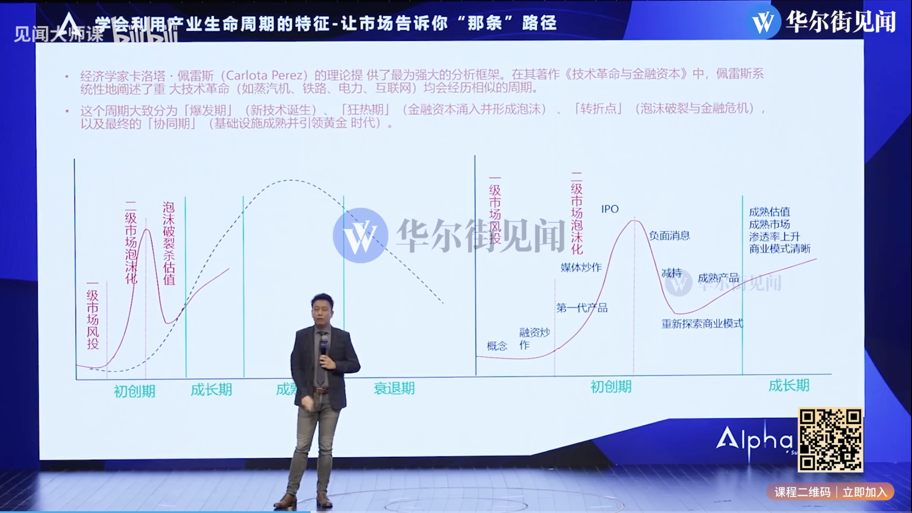
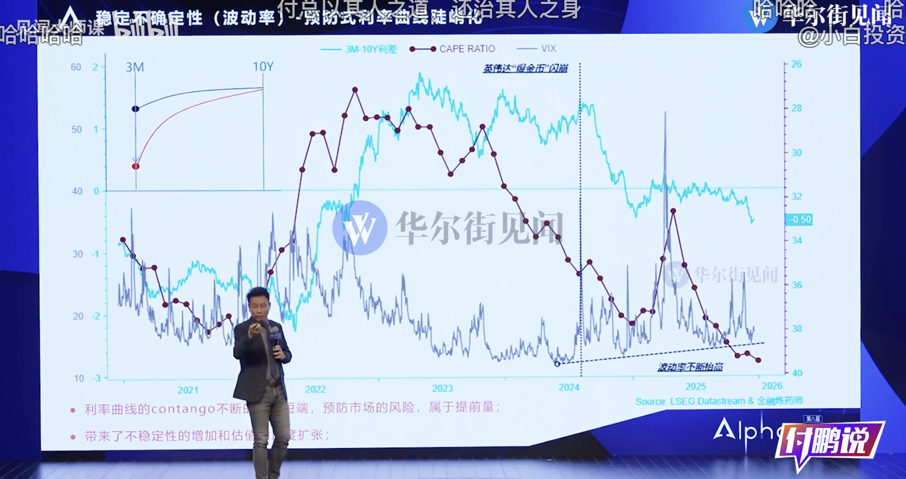
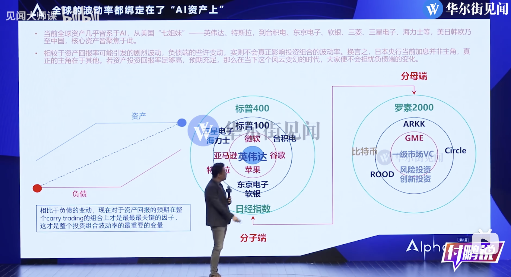

最近看了付鹏的两个演讲（Alpha峰会[^1]，彭博商业周刊活动[^2]），又学到了不少知识。之前纠结的很多问题，其实早已经确定。

为什么英伟达财报出来后暴跌？日元加息对全球股市到底有没有影响？

## 二级市场是一级市场未来的镜像 {#二级市场是一级市场未来的镜像}

一级市场是广泛性投资，而根据一级市场的投资结果，可以得到二级市场的投资方向。

15, 16 年杀估值后，AI类资产开始走向价值投资阶段。一级市场告诉大家 AI 一定是未来的方向。

22年后 NVDA 是金铲子，波动率过低 =&gt; 确定性过高（市场共识，买 NVDA 必赚） =&gt; 市场上杠杆。
杠杆过多会带来稳定性风险。

类似的，日元加息为什么影响没那么大？

因为目前收益确定，负债（carry trending中的日元利息）并不重要。
重要的是资产是否出问题，即AI如果是泡沫，日元不加息也完蛋；AI不是泡沫，那点负债更不重要。

## 股市是全要素生产率的反应 {#股市是全要素生产率的反应}

股价上涨可以反推出全要素生产率（ **生产力/科技进步（影响成长叙事与估值）、价值因素、制度性变化带来的红利** ）出现了变化。

根据过去美股走势，股价上涨（生产力发展）时，黄金价格波动。近年来出现了股价和黄金价格同时上涨，足以说明黄金价格上涨的长期驱动因素并非生产力，而是近年来的世界秩序变化。
在近来，中美韩国会谈结论尚未宣布、俄乌停战存在可行性，黄金的长期驱动因素可能不再存在。

---

[^1]: 付鹏：AI生产力能否改变生产关系？前瞻2026年大类资产波动背后深层逻辑 Alpha峰会视频 [录像]. <https://www.bilibili.com/video/BV1H5qrByEAE/?spm_id_from=333.337.search-card.all.click&vd_source=d25e36e4d6d6a6f9b43d641d4063ba06>

[^2]: 付鹏纯净版(11月28日) ：2026年投资展望，怎么投才能赚钱？黄金|股息红利|AI|哑铃型结构 [录像]. <https://www.youtube.com/watch?v=xSxZiaW5k6k>
